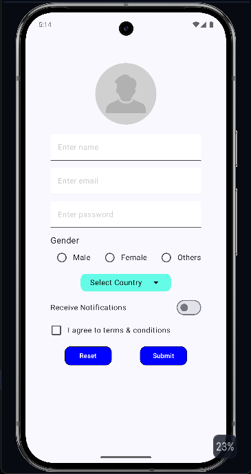
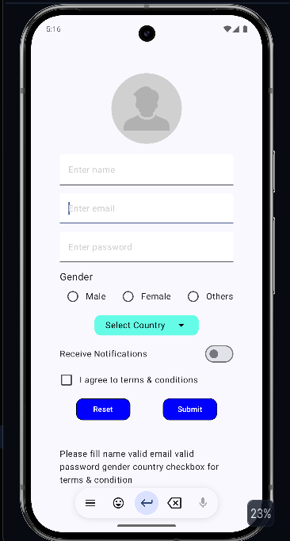
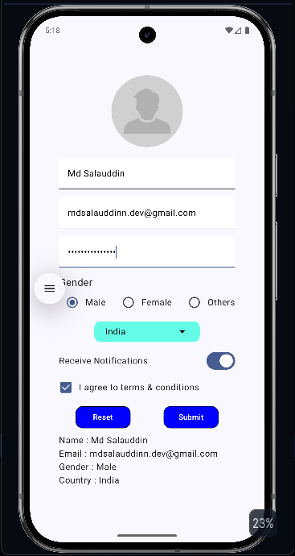

# Registration Form

> A simple registration form application built using Kotlin and Jetpack Compose.

## 📖 Overview

> A registration form allows users to enter their personal information, validate the input and if all inputs are valid then show the details entered by user.

## ✨ Features

- Clean Registration form UI.
- User input using TextFields.
- Gender selection with Radio Buttons.
- Country Selection with Dropdown Menu.
- Notification preferences using Switch.
- Terms & Conditions acceptance using Checkbox.
- Form validation for all required fields
- Email format validation.
- Password length validation.
- Display entered information after successful registration.
- Reset all fields with a single click.
- Developed using Kotlin and Jetpack Compose.

## 📱 Screenshots

### Home Screen

### Validation

### Result

## 🛠️ Tech Stack

- Kotlin
- Jetpack Compose
- Android Studio

## 📚 What I Learned

- Building user interfaces using Jetpack Compose.
- Managing UI state with 'remember' and 'mutableStateOf'.
- Handling user input with 'TextField',
- Implementing 'Checkbox', 'Dropdown Menu', 'Switch' and 'Radio Button'.
- Validating user inputs such as email and password.
- Displaying UI conditionally based on application state.
- Creating reusable Composable functions.
- Organizing a Compose project into multiple components.

## Author

**Md Salauddin**,

B.Tech CSE Student